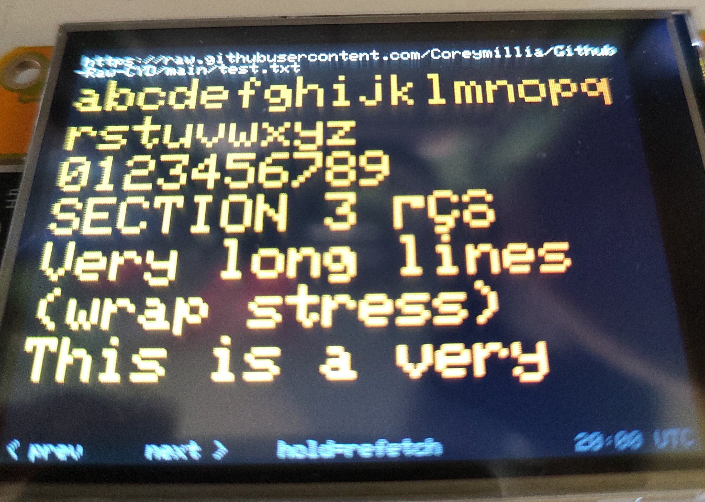
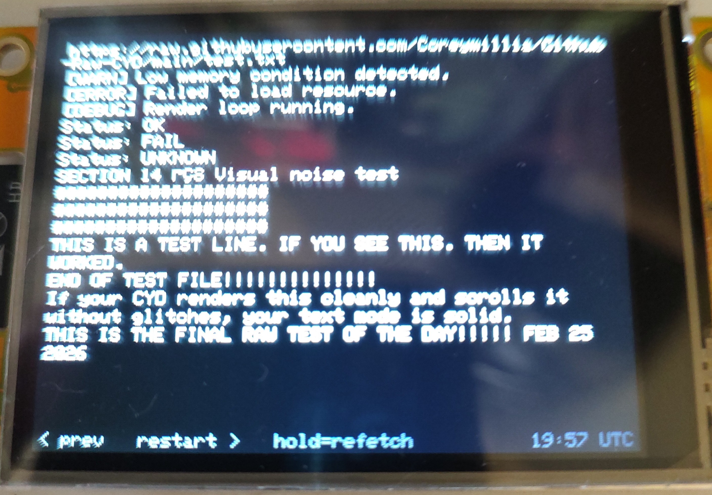

# GithubRaw — GitHub Text Feed Viewer for ESP32 CYD

A simple ESP32 firmware for the **Cheap Yellow Display (CYD)** that fetches and displays any plain `.txt` file directly from `raw.githubusercontent.com` — no API key, no JSON, no parsing. Just a URL and a file.

Edit the file on GitHub, commit it, and your device picks up the new content automatically every 15 minutes. Or hold the BOOT button to refresh instantly.

---

## Photos

| | |
|---|---|
|  |  |
| *Rainbow mode — each line a different color, medium font* | *Small font showing full paragraph paging with navigation bar* |
|  |  |
| *Large font with automatic word wrapping* | *Last page reached — tap right to restart from beginning* |

---

## What Is It?

GithubRaw turns a $10 ESP32 display board into a **live text feed reader** driven entirely by a plain text file in a GitHub repository. There are no servers to run, no cloud accounts to pay for, no APIs to authenticate against. You push a commit and the screen updates.

### What can you use it for?

**If you have a following on GitHub:**
- Post daily notes, project updates, or changelogs that anyone with a device can subscribe to
- Share a short "what I'm working on" message that updates whenever you push
- Run a dev blog in plain text — no website required
- Post release notes or version announcements directly to followers' desktops

**If you follow someone on GitHub:**
- Keep a feed of any public `.txt` file from a repo you watch
- Display a developer's public status feed, roadmap, or notes on your desk
- Follow a project's changelog as it evolves in real time

**Personal and home use:**
- Daily to-do list or reminders you maintain in a GitHub repo
- Shopping list, chore list, or family notes board — edit from your phone, appears on the display
- Motivational quotes, daily affirmations, or a reading list you maintain as a text file
- Personal journal entries or daily log you want visible on your desk

**Tech and maker use:**
- Server status board — write a script that commits a status `.txt` to GitHub on a schedule
- Uptime monitor output, cron job results, or build status in plain text
- Display the README of a project you're actively contributing to
- Track issues or milestones you manually maintain in a text file

**The key idea:** Any human-readable `.txt` file on any public GitHub repo works. If someone on GitHub is maintaining a public text feed, you can point this device at it.

---

## Hardware Required

- **ESP32 CYD** (Cheap Yellow Display) — ESP32 + ILI9341 2.8" 320×240 touchscreen
  - Any variant with the standard CYD pinout works
- USB cable for flashing
- 2.4 GHz WiFi network

---

## Software Required

- [PlatformIO](https://platformio.org/) (VS Code extension recommended)
- No additional accounts or API keys needed

---

## Setup

### 1. Clone or download this repo

```bash
git clone (https://github.com/Coreymillia/Github-Raw-CYD)
cd GithubRaw
```

### 2. Flash the firmware

Open the folder in VS Code with PlatformIO installed, then click **Upload**.

NOTE: IF YOU FLASH WHITE SCREEN USE THE INVERTED FOLDER FILES!

### 3. Configure via the setup portal

On first boot the CYD starts a WiFi access point named **GithubRaw_Setup**.

1. Connect your phone or laptop to **GithubRaw_Setup**
2. A captive portal SHOULD open. If it does not, then turn off your mobile data and follow step 3. 
3. Open a browser and go to **192.168.4.1**
4. Fill in:
   - **WiFi SSID** and **Password** (2.4 GHz only)
   - **Raw GitHub URL** — the full `https://raw.githubusercontent.com/...` URL of your `.txt` file
   - **Text Color** — White, Green, Cyan, Yellow, Orange, Red, or 🌈 Rainbow
   - **Text Size** — Small, Medium, or Large
5. Tap **Save & Connect**

> **Tip:** To get the raw URL, open your `.txt` file on GitHub, click the **Raw** button, then copy the address bar. It will always start with `https://raw.githubusercontent.com/`.

> **To re-enter setup** on any subsequent boot: hold the BOOT button while powering on.

---

## Controls

| Action | What it does |
|---|---|
| **Tap right half of screen** | Next page |
| **Tap left half of screen** | Previous page |
| **Short press BOOT button** | Next page (backup) |
| **Hold BOOT button (~1 sec)** | Re-fetch file immediately and return to page 1 |
| **Auto (every 15 minutes)** | Silently re-fetches and returns to page 1 |

The bottom bar always shows navigation hints and a UTC clock.

---

## Display Modes

| Mode | Description |
|---|---|
| **Small** | ~20 lines per screen, ~40 characters wide |
| **Medium** | ~11 lines per screen, ~26 characters wide |
| **Large** | ~7 lines per screen, ~17 characters wide |
| **🌈 Rainbow** | Each line a different color — cycles through cyan, green, yellow, orange, red, magenta, white |
| **Color Select** Choose one of any of the colors of the above colors. 
Long lines are automatically word-wrapped. Windows (CRLF) and Unix (LF) line endings both work.

---

## Creating Your Text Feed

Any public GitHub repository works. Create a `.txt` file, commit it, and point the device at the raw URL.

**Example file structure:**
```
My GitHub Feed - Updated Feb 2026
==================================

Currently working on: GithubRaw firmware
Status: Testing complete, works great!

Latest notes:
- Touch navigation added
- Rainbow color mode
- 15-min auto refresh

Check back soon.
```

After you edit and commit the file, GitHub's raw CDN typically updates within **3–5 minutes**. The device auto-refreshes every 15 minutes, or you can hold BOOT to pull the update immediately.

---

## Project Structure

```
GithubRaw/
├── src/
│   └── main.cpp          # Main firmware — fetch, paginate, render, touch
├── include/
│   ├── Portal.h          # WiFi captive portal + NVS settings (url, color, size)
│   └── HTTPS.h           # Simple HTTPS GET → String
├── platformio.ini        # Build config
└── README.md
```

---

## Dependencies

| Library | Purpose |
|---|---|
| [GFX Library for Arduino](https://github.com/moononournation/Arduino_GFX) | ILI9341 display driver |
| [XPT2046_Touchscreen](https://github.com/PaulStoffregen/XPT2046_Touchscreen) | Resistive touchscreen |
| WiFiClientSecure / HTTPClient | Built-in ESP32 Arduino core |
| Preferences | NVS flash storage for settings |

All dependencies are managed automatically by PlatformIO.

---

## Notes

- Only **public** repositories work — no auth tokens are used
- The URL **must** start with `https://` (not `http://`)
- The ESP32 supports **2.4 GHz WiFi only** — 5 GHz networks will not work
- Very large files (hundreds of KB) may be slow to fetch but will paginate correctly
- Settings are saved to flash — WiFi credentials and URL survive power cycles

---

*Built for the ESP32 CYD. Firmware written from scratch with PlatformIO and Arduino framework.*
